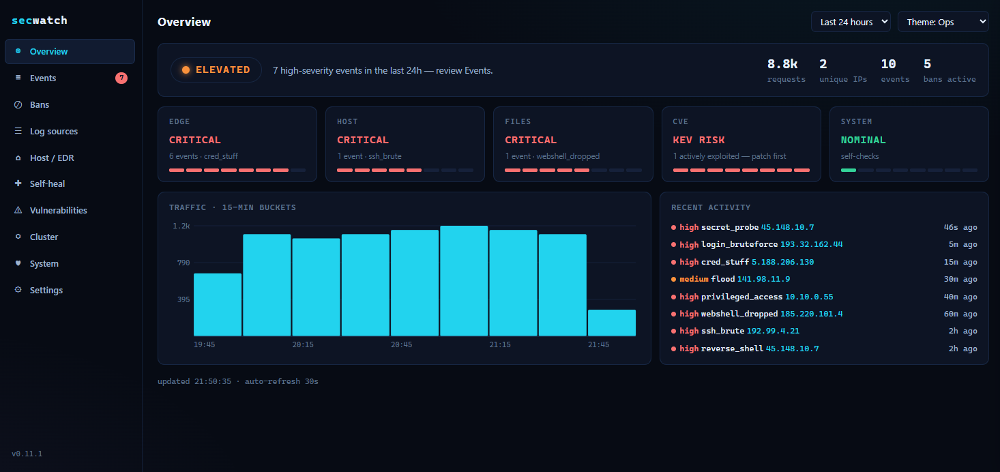
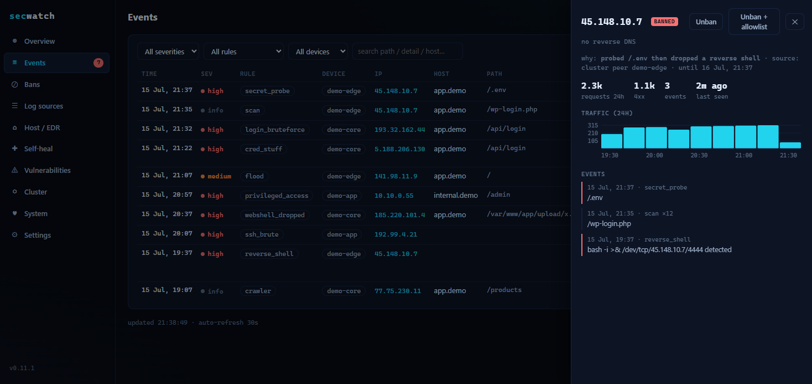
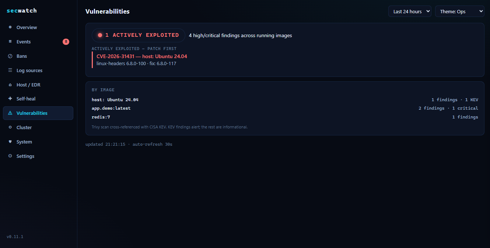
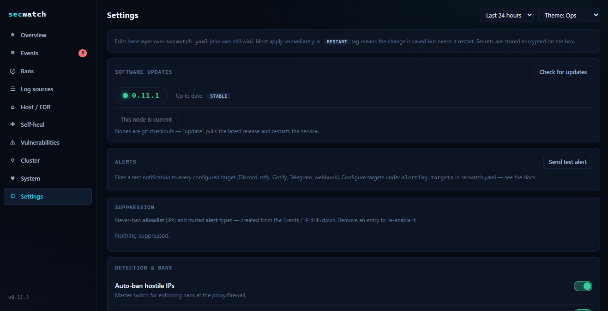
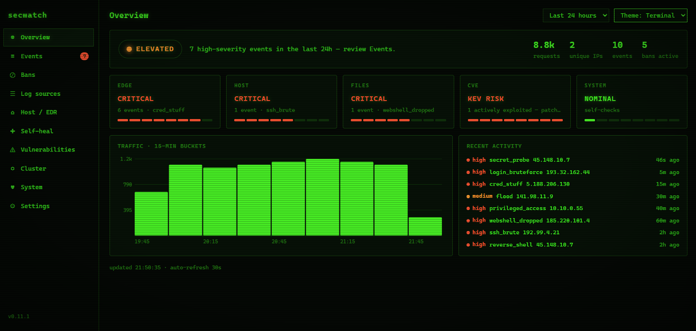
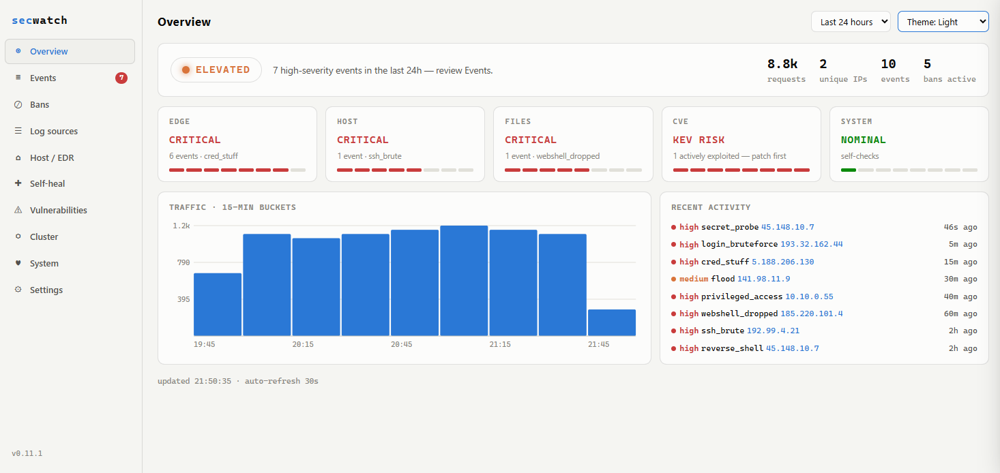

<p align="center">
  <picture>
    <source media="(prefers-color-scheme: dark)" srcset="docs/brand/logo-dark.svg">
    
  </picture>
</p>

<p align="center">
  <b>The easy, all-in-one security monitor for your self-hosted server.</b><br>
  Edge detection, auto-ban, host/EDR-lite, CVE awareness, and optional local-LLM
  traffic analysis — one lightweight tool, one config file, one command to install.
</p>

<p align="center">
  <a href="https://github.com/Paco5687/secwatch/actions/workflows/ci.yml"></a>
  <a href="LICENSE"></a>
</p>

<p align="center">
  
</p>

---

secwatch watches your reverse proxy's access log **and your internal apps' logs**,
keeps an eye on host/process/container state, auto-bans hostile IPs at the edge, and
serves a self-contained dashboard — so you can actually *see* what's hitting your
box and what it's doing. No agents-and-managers stack, no external SaaS, no
account required.

> **Who it's for:** homelabbers and small-fleet admins who expose a few apps
> behind Traefik / nginx / Caddy — and often run internal-only apps too — and want
> real security visibility **without** standing up and wiring together
> CrowdSec + Wazuh + Trivy + fail2ban separately.

## Why secwatch (and how it compares)

secwatch doesn't try to replace the heavyweights — it **rolls the pieces most
homelabbers actually want into one readable, low-dependency tool**:

| You might otherwise run… | …for | secwatch does it |
|---|---|---|
| **fail2ban** | ban brute-forcers from logs | ✅ edge + auth, app-aware |
| **CrowdSec** | edge detection + auto-ban (+ crowd intel) | ✅ edge detection + auto-ban¹ |
| **Wazuh** | host FIM / persistence / EDR | ✅ FIM, persistence, process/egress (lite) |
| **Trivy / Grype** | image CVE scanning | ✅ + CISA-KEV "actively exploited" flag |
| *(nothing common)* | plain-English traffic analysis | ✅ optional local-LLM analyst |

¹ secwatch now has an OPTIONAL, self-hostable crowd-intel layer too (see CROWD.md) — off by default, attacker-IPs-only. **If you already run and love CrowdSec or Wazuh,
keep them** — secwatch is for people who find that stack too much and want one
small thing they can read the source of. Honest scope: it's a monitoring and
mitigation *aid*, not a firewall or a patch manager.

## Features

- **Edge detection + auto-ban** — vuln probes, path scanning, floods, credential
  stuffing, secret-file probes (`.env`/`.git`/…), and declarative per-endpoint
  rules (login brute force, admin abuse, API scraping, IDOR enumeration). Hostile
  IPs are banned at the proxy (Traefik / nftables / nginx).
- **Watches every app, not just the edge** — point it at multiple access logs at
  once (your reverse proxy *and* internal apps that don't sit behind it). One
  detection engine, so bans and rules apply across all of them. Add or
  **auto-discover** ("Scan for logs") sources right from the dashboard — no restart,
  no YAML editing.
- **Host & EDR-lite** — SSH/auth monitoring; a persistence baseline (systemd
  units, SUID, `ld.so.preload`, cron, shell rc, UID-0 accounts); process
  signatures (reverse shells, miners, temp-dir execs); new-egress/C2 awareness.
- **File integrity** — webshell/dropped-script detection in web roots + ransomware
  canaries.
- **CVE awareness** — Trivy-scans the **host's OS packages** (no Docker needed)
  *and* running container images, reports only fixable HIGH/CRITICAL CVEs, and
  flags the ones on the CISA KEV list (actively exploited in the wild).
- **Watchdogs** — alerts if the access log goes silent or the proxy's route config
  changes unexpectedly.
- **Prometheus metrics** — `GET /metrics` exposes events, bans, CVE findings, and
  cluster state for scraping; ship-ready **Grafana dashboard** in `deploy/`. Gated by
  loopback / a bearer token so it's never open on a public interface.
- **Optional LLM analysis** — point it at any OpenAI-compatible endpoint (local
  Ollama/vLLM or a remote API) for a plain-language traffic assessment. Off by
  default.
- **Self-contained dashboard** with a built-in login for direct `IP:PORT` use, and
  alerting to Discord, **ntfy, Gotify, Telegram, or a generic webhook** (any number
  of targets; test them from Settings).

## A look inside

<table>
<tr>
<td width="33%"><a href="docs/screenshots/events-drilldown.png"></a><br><sub><b>Every ban explained</b> — the evidence trail, the source, and one-click unban / allowlist / mute.</sub></td>
<td width="33%"><a href="docs/screenshots/vulnerabilities.png"></a><br><sub><b>CVE awareness</b> — fixable HIGH/CRITICAL, actively-exploited (CISA-KEV) surfaced first.</sub></td>
<td width="33%"><a href="docs/screenshots/settings.png"></a><br><sub><b>Configure in-app</b> — updates, alert targets, and suppression, no YAML required.</sub></td>
</tr>
</table>

**Themeable** — the Ops theme above, plus Terminal and Light:

<p align="center">
  
  
</p>

## Quick start

**One command** — installs everything and starts secwatch as a background service:

```bash
curl -fsSL https://raw.githubusercontent.com/Paco5687/secwatch/main/install.sh | sudo sh
```

It uses **uv** to fetch a self-contained, pinned Python (so the host's Python
version/packaging doesn't matter — falls back to the system `python3` if uv can't
be used), sets up a virtualenv, writes config (port `8931` + an auto-generated
admin password it prints), and **installs + starts the systemd service** — no
prompts. It ends with `✅ secwatch is ACTIVE — open http://IP:8931/`.

Customize with env vars: `SECWATCH_PORT`, `SECWATCH_ADMIN_PASSWORD`,
`SECWATCH_NO_AUTH=1` (open dashboard on a trusted LAN), `SECWATCH_NO_START=1`,
`SECWATCH_NO_UV=1` (skip uv, use the system Python).

> **Won't expose an open dashboard by accident:** if secwatch would serve the
> dashboard on a network interface with no password, it protects a **public**
> interface by falling back to `127.0.0.1` (stays up, just not exposed) and only
> **warns** on a **private LAN** (`10.x`/`192.168.x`/`172.16.x`) — it never
> crash-loops. Set a password (the installer does) or `SECWATCH_NO_AUTH=1` to run
> open on a trusted LAN and silence the warning.

Prefer to review the code first? Clone and run the same installer:

```bash
git clone https://github.com/Paco5687/secwatch && cd secwatch
./install.sh        # one sudo prompt to install the service; otherwise identical
```

`secwatch install` auto-detects your reverse proxy + access log, app hosts,
network topology (→ trusted nets), running images, web dirs, and any local LLM
endpoint, writes a reviewable `secwatch.yaml`, and can generate a systemd unit.

Configuring by hand? `cp secwatch.example.yaml secwatch.yaml`, edit it (or run
`python -m secwatch.init` to draft one from your host), then `python -m secwatch.main`.

### See it first (demo mode)

Want to look before you point it at real logs? Demo mode seeds a throwaway DB with
realistic synthetic activity (probes, brute force, a webshell, bans from several
sources, a KEV CVE) and serves the dashboard — no config, no real data:

```bash
git clone https://github.com/Paco5687/secwatch && cd secwatch
pip install -r requirements.txt
python -m secwatch.demo        # → http://127.0.0.1:8931/
```

It binds loopback with auth off and uses a separate `demo.db`, so it never touches a
real deployment.

## Configuration

Everything host-specific lives in `secwatch.yaml` (see the fully-commented
`secwatch.example.yaml`); any value can also be set via a `SECWATCH_*` env var.
Highlights: `log_source.type` (traefik/nginx/caddy/regex), `log_sources` (watch
several at once), `ban.actuator` (traefik/nftables/nginx/none),
`network.trusted_nets` (keep it **narrow**), `endpoint_rules`, `auth.*`
(dashboard login), `llm.*` (optional). You can also add or scan for extra log
sources live from the dashboard's **Log sources** card.

Prefer clicking to editing YAML? The dashboard's **Settings** page edits the
commonly-tuned settings in-app (alerting, LLM, detection thresholds, feature
toggles) — most apply live, secrets are stored encrypted at rest, and it layers
over `secwatch.yaml` (env vars still win). Security-critical settings (trusted
networks, ban actuator, dashboard auth) stay YAML-only by design.

> **Version-controlling your infra?** secwatch writes a machine-managed ban file
> (`secwatch-bans.yml`) into your proxy's config dir and rewrites it on every ban
> change (it's stamped with a "managed by secwatch — do not edit" header). If that
> directory is a git repo, add `secwatch-*.yml` to its `.gitignore` so the ban churn
> doesn't flood your history. secwatch's own runtime state (DB, secrets, snapshots)
> all lives under `data/`, which is already gitignored — so a clone-and-run never
> stages your secrets.

## Alerting

Point secwatch at a **Discord webhook** to get pushed high-severity alerts. Keep
the URL in a gitignored secrets file (see `discord-webhook.env.example`), inline
as `alerting.discord_webhook_url`, or via `SECWATCH_DISCORD_WEBHOOK_URL`:

```yaml
alerting:
  discord_webhook_file: /path/to/.secrets/discord-webhook.env
```

secwatch **bans and records everything** it detects, but by default it does *not*
alert on the constant background of blocked internet scanning (`.env`/`.git`
probes, path scans, floods, 403'd `/admin` hits) — that noise buries the events
that matter. Those still ban + show on the dashboard; tune what's quiet with
`alerting.quiet_rules` (a probe from an internal IP still alerts). Full details in
the [Wiki](https://github.com/Paco5687/secwatch/wiki/Alerting).

## Is it still working? (watchdog + fire-drill)

A monitor you can't trust is worse than none. Two features close that gap:

**Dead-man's-switch.** secwatch's own alerts can't fire if secwatch is *dead*
(crash, hung box, pulled power). So it pings an external monitor on an interval and
lets the monitor alert on the **absence** of that ping. Wire it to
[Uptime Kuma](https://github.com/louislam/uptime-kuma) in a minute:

1. Kuma → **Add New Monitor** → Monitor Type: **Push**.
2. Set **Heartbeat Interval** a bit longer than secwatch's (e.g. secwatch pings
   every 60s → set Kuma to 120s) so a slow ping isn't a false alarm.
3. Copy the **Push URL** Kuma shows (`http://kuma:3001/api/push/<token>`), and add
   a notification (Discord, etc.) to that monitor.
4. Put the URL in secwatch and restart:
   ```yaml
   monitoring:
     heartbeat_url: "http://kuma:3001/api/push/<token>"
     heartbeat_interval: 60
   ```

Healthy cycles ping `status=up`; a degraded self-check pings `status=down` and
names the broken check — so Kuma also catches *alive-but-broken*, not just dead.
Works the same with healthchecks.io or any dead-man's-switch service.

**Fire-drill.** Settings → **Run fire drill** (or `POST /api/selftest/firedrill`)
exercises the real detect → ban → enforce → restore chain on demand and reports
each stage green/red — proof the pipeline works *right now*, not in theory. It
injects a synthetic attack from TEST-NET `203.0.113.7` (never a real host),
confirms the ban reaches the edge and the proxy is up, then restores your ban list
**byte-for-byte**. Zero footprint, even if a stage fails.

## Cluster (fleet)

Run secwatch on several boxes and join them into a **peer-to-peer cluster** — no
central hub. Every node stays fully autonomous (it detects + bans *itself*), and
nodes gossip bans so **a hit on one hardens all**, while any peer can view the
whole fleet. Membership is by explicit join with a shared secret (never
auto-discovery), and inter-node requests are HMAC-signed.

**Easiest: the dashboard's Cluster tab** — pick a role, click **Create cluster**
(copy the secret) or **Join cluster** (paste a peer's URL + secret). No CLI, no
restart. To add more boxes, **Add a device** hands you a one-liner
(`curl -fsSL "http://SEEDER:8931/install.sh?token=…" | sudo sh`) that installs
secwatch and auto-joins — RMM-style. The token is single-use; the script carries
the cluster secret, so run it only over your trusted network. Or from the shell:

```bash
# on the first node:
python -m secwatch.cluster init          # prints the shared secret
# on each other node (set cluster.role in secwatch.yaml first, then):
python -m secwatch.cluster join http://FIRST-NODE:8931 '<secret>'
```

Roles (config `cluster.role`): **peer** — full member (shares bans, viewable,
reads peers); **leaf** — push-only for exposed/less-trusted boxes (contributes
its bans + events and pulls the blocklist, but isn't queryable and can't read
peers, so a compromised edge box can't recon or poison the cluster). A leaf only
makes *outbound* connections, so its port can stay firewalled. See the
[Cluster wiki page](https://github.com/Paco5687/secwatch/wiki/Cluster).

> **Networking:** **peers** must be able to reach each other on the dashboard port
> (default `8931`) — that's how they gossip bans and show the fleet view. If a host
> firewall blocks it, peers appear in the roster but show **unreachable** in the
> dashboard (with fix hints). Open the port **to your cluster's subnet only**, e.g.
> `sudo ufw allow from 10.0.0.0/24 to any port 8931 proto tcp` — not to the whole
> internet. A **leaf** needs no inbound rule at all (it only connects out).

**Keeping the fleet current** — each node is a git checkout, so the dashboard's
**Cluster → Software updates** card shows the running vs. latest version and
updates a node in place (`git pull` + restart). From a **peer** you can **Update
entire fleet** in one click: reachable peers update immediately and **leaf** nodes
(which nothing can reach) pull the update on their next sync — so you press the
button once and every box, including firewalled edges, converges. Set
`update.auto: true` for hands-off updates, or `update.allow_remote: false` to pin a
box. See the [Updates wiki page](https://github.com/Paco5687/secwatch/wiki/Updates).

## Deploying with Docker

Pull the published multi-arch image (built for amd64 + arm64 on each release):

```bash
docker run -d --name secwatch -p 8931:8931 -v secwatch-data:/app/data \
  ghcr.io/paco5687/secwatch:latest
```

…or build from source with compose:

```bash
docker compose up -d      # see docker-compose.yml for mounts + the mode options
```

## Proxmox LXC (one-liner)

Run on the **PVE host** to create a Debian container and install secwatch in it
(review the script first — it makes a container and runs the installer inside):

```bash
bash -c "$(curl -fsSL https://raw.githubusercontent.com/Paco5687/secwatch/main/deploy/proxmox-lxc.sh)"
```

Override defaults via env, e.g. `CTID=141 RAM=1024 DISK=6 BRIDGE=vmbr1 bash proxmox-lxc.sh`.

`SECWATCH_MODE` = `all` (one privileged container), `core` (isolated web core), or
`agent` (host collectors only, forwarding to a core). The **core + agent** split
keeps the internet-facing core low-privilege while the deep-host-access part stays
a minimal host process.

## Documentation

Full how-to guides live in the **[Wiki](https://github.com/Paco5687/secwatch/wiki)** —
installation, configuration reference, log sources (multi-source + dashboard),
detection & bans, dashboard auth, CVE/LLM/crowd-intel, Docker & deployment modes,
and troubleshooting.

## Requirements

Python 3.11+. Optional: Docker (CVE scan + container watch), an OpenAI-compatible
LLM endpoint (AI analysis), `nft`/`nginx` for those ban actuators.

## Security

Found a vulnerability in secwatch? **Please report it privately** — see
[SECURITY.md](SECURITY.md) for the disclosure process. Don't open a public issue for
security bugs, and don't file exploit details for third-party software here.

## Contributing

Issues and PRs welcome — new log-source/ban adapters, detection rules, and distro
testing especially. secwatch is young; real-world reports make it better. See
[CONTRIBUTING.md](CONTRIBUTING.md) and our [Code of Conduct](CODE_OF_CONDUCT.md);
release-by-release changes are in [CHANGELOG.md](CHANGELOG.md).

## License

[MIT](LICENSE)
